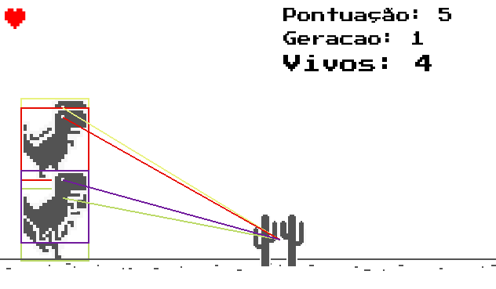

# 🦖 Dino-AI


Este projeto recria o clássico jogo do dinossauro offline do Google Chrome, mas com um toque especial: uma **Inteligência Artificial (IA)** evolui para jogar sozinha usando o algoritmo **NEAT (NeuroEvolution of Augmenting Topologies)**.

## 📌 Sobre

Utilizando a biblioteca **Pygame** para a renderização do jogo e a biblioteca **NEAT-Python** para treinar uma IA, o objetivo é criar uma população de dinossauros que evoluem ao longo das gerações e aprendem a desviar dos obstáculos (cactos).

> ⚠️ Obs: No momento, o jogo possui apenas cactos como obstáculos e o dinossauro só pula (com tecla **Espaço**). Não há ação de abaixar nem pássaros no cenário.

## 🎮 Como jogar

### Manualmente (modo jogador):
Use a **barra de espaço**:
- Barra de espaço: pular

### Automaticamente (modo IA):
Na **tela inicial**, selecione o botão **IA** e observe a inteligência artificial aprendendo a jogar sozinha 🧠⚡

## 🧠 Treinamento da IA

A IA é treinada utilizando o algoritmo **NEAT**, que simula um processo evolutivo:
- Cada dinossauro é um agente com uma rede neural.
- A rede recebe como entrada:
  - A distância horizontal até os **dois cactos mais próximos**

Com base nessas informações, a IA decide se deve pular ou continuar correndo.

## 📂 Estrutura do Projeto

```
📁 dino-ai/
├── Assets/                       # Sprites e fontes do jogo
├── Classes/
│   ├── Cactus.py                 # Obstáculos
│   ├── Chao.py                   # Chão do jogo
│   ├── Dinossauro.py             # Classe do dinossauro
│   ├── Jogo.py                   # Mecânicas principais
│   ├── TelaGameOver.py           # Tela de Game Over
│   ├── TelaGameOverIA.py         # Tela de Game Over da IA
│   ├── TelaInicial.py            # Tela inicial do jogo
│   ├── TelaJogo.py               # Execução modo jogador
│   └── TelaJogoIA.py             # Execução modo IA
├── config.txt                    # Configuração do NEAT
├── constantes.py                 # Constantes do jogo
├── jogo.py                       # Script de execução principal
└── README.md
```

## ⚙️ Requisitos

- Python 3.10 ou superior
- Bibliotecas:
  - `pygame`
  - `neat-python`

### Para instalar os requisitos:

```bash
pip install -r requirements.txt
```

## ▶️ Como executar

```bash
python jogo.py
```

> Ao iniciar, você poderá escolher entre os botões **Jogar** (modo manual) ou **IA** (modo automático com inteligência artificial).

## 📷 Imagem do Jogo




## 👨‍💻 Autor

Feito por [Matheus Borba](https://github.com/mthperera) com dedicação.
